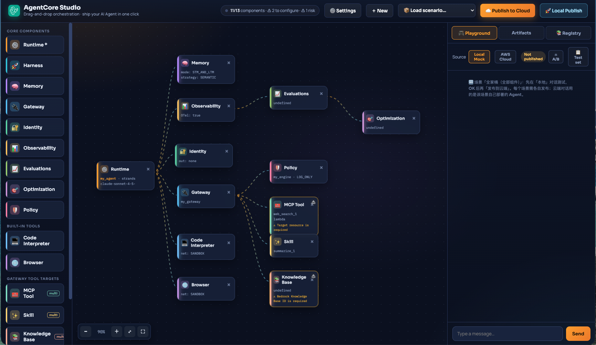
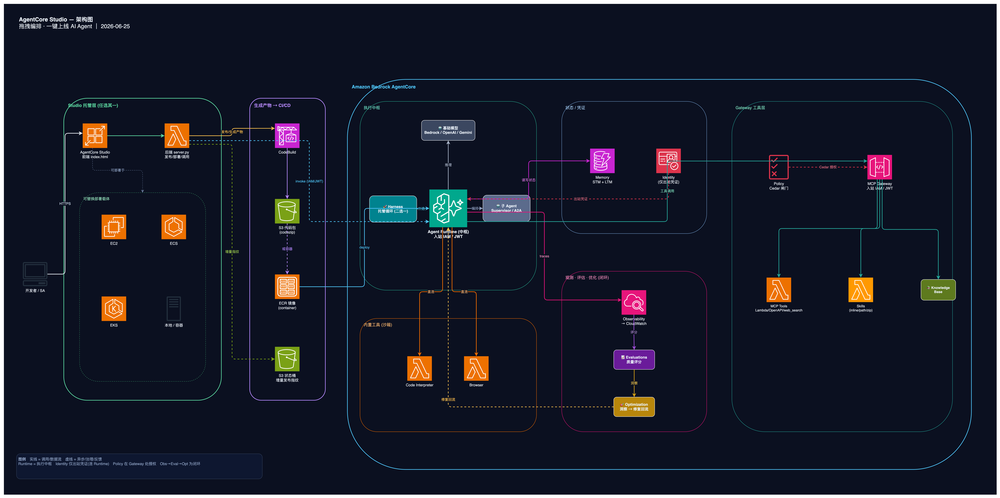

# AgentCore Studio

> Drag, orchestrate, ship your AI Agent in one click ｜ From canvas to cloud in minutes
>
> 🌐 English ｜ [中文](README.md)

**AgentCore Studio** is a visual orchestration workbench for Amazon Bedrock AgentCore. On the canvas you drag in core components — Runtime / Harness, Memory, Gateway, Identity, Observability, Policy — plus the Code Interpreter and Browser built-in tools and the MCP tools / Skills mounted under a Gateway, assembling an AI Agent like building blocks. Every configuration change **generates real, deployable artifacts in real time** (entry code, deploy script, IAM policy, component registry) and registers them instantly in the Registry. When you're done, **publish to the cloud in one click** for a real deployment to AWS, then chat with the Agent directly in the built-in **Playground** to verify it: locally wired to real Bedrock for sub-second feedback, and trustworthy when running in the cloud.



## Architecture



> Developers orchestrate by dragging in Studio (deployable on App Runner / EC2 / ECS / EKS / locally) → the generated artifacts are deployed via CI/CD (CodeBuild → S3 → ECR) → the Agent Runtime in Amazon Bedrock AgentCore drives Memory, Identity, Policy, Observability, the Gateway tool layer, and the built-in sandbox tools. The editable source is in [`architecture.drawio`](architecture.drawio).

## Features

### 🎨 Visual orchestration
- Drag-and-drop all AgentCore components; click a node to edit it in a popover, with field interlocks on dropdown change (e.g. Skill source inline/path/upload, Identity inbound/outbound, Gateway IAM/JWT, Policy Cedar/natural-language, Runtime code source ECR/S3)
- ⚙️🚀 **Dual hub — Runtime or Harness**: Runtime (ships its own orchestration code, deployed as a container/artifact) or Harness (declarative, AgentCore-managed agent loop, with immutable versions + named endpoints for instant rollback) — pick one, switch as needed
- ✨ **AI-generated canvas (NL→Canvas)**: describe the agent you want in one line and get an **editable canvas** of nodes and edges generated automatically; keep dragging to refine, with automatic pre-flight checks
- 📦 **One-click scenario templates**: minimal chat / customer support (with tools) / data analysis / the full stack — fill the canvas in seconds
- 🔗 Accurately-related edges (Runtime is the hub; MCP/Skill hang under the Gateway)

### 🎮 Playground: sub-second local verification → iteration loop
- **Locally connects straight to Bedrock `converse` for real model replies** / or the AWS cloud source; the source is **labeled honestly**: Local · live (runs the tools you orchestrated) / Local · model (model only, tools not run) / Local sim / AWS cloud
- **System Prompt edits take effect instantly** — the system prompt is passed to the Agent on every turn, so tweaking one line shows the new behavior immediately, no redeploy
- 🔍 **Trace inspection**: expand any reply to see tool calls (inputs/results), token usage, latency, and model — one data source shared by local and cloud
- ⚖️ **A/B compare**: same input, baseline vs candidate System Prompt side by side, so you can tell directly whether a change made things better or worse
- 📋 **Test set**: save a group of inputs and run them all in one click; results are **diffed against the last run** (new / changed / unchanged) for lightweight regression
- 💾 **Persistent chat history**: each Agent's chat and history are stored locally and survive a refresh

### 📄 Real-time artifacts & publishing
- Generates `agentcore_entry.py` / `deploy.sh` / `iam-policy.json` / `requirements.txt` / `registry.json` in real time; the Registry logs all components, built-in tools, and MCP/Skills
- ✅ **Pre-flight validation**: beyond completeness checks, it runs **cross-node semantic / region / safety** checks (web_search is us-east-1 only, cross-region knowledge bases, an ENFORCE Policy with no permit locking everything, public-egress risk, etc.), showing a live "risk" count in the status bar at design time and prompting before deploy
- 🚀 **Publish pipeline trace**: shows the component publish path while publishing, lighting up step by step (pending → in progress → ✓); runs as a background job + progress polling (immune to streaming timeouts), with live logs and a deploy-timer heartbeat
- ⚡ **Incremental publish (three states)**: judged by fingerprint — artifact/code changed → full rebuild; control-plane config only (protocol/timeout/env vars/description, etc.) → `update-agent-runtime` second-level update (reuses the artifact, keeps the ARN); unchanged → skipped. Identity / MCP Target / Policy / Memory / Gateway all support in-place fast updates
- ☁️ **One-click publish to the cloud**: if it hasn't been published locally it auto-publishes first, then does a real deployment to AWS Bedrock AgentCore (in-place update — the old version keeps serving during the rebuild) and switches to the Playground to watch live progress; auto-detects an already-ready cloud Agent as a demo fallback

### 🧩 Multi-agent & reuse
- **Multi-agent orchestration**: pull already-published agents from the cloud and generate an orchestrator Agent in one click — Supervisor (the controller wraps each sub-agent as a tool and calls it on demand) or A2A (collaborate with peer agents by passing JSON-RPC `message/send` through `InvokeAgentRuntime`; A2A mode only lists agents deployed with `--protocol A2A`). The canvas automatically draws the orchestrator↔sub-agent relationships
- **Import an existing Agent to keep editing**: on publish, the entire canvas configuration is archived to the S3 state bucket (`specs/<name>.json`); on import, Studio pulls the cloud agent list and cross-marks which are "importable", then one click reads the config back and **rebuilds an editable canvas** to tweak and re-publish. Works only for agents published by Studio

> Details: model IDs automatically get the cross-region inference profile prefix per region (`us.`/`eu.`/`apac.`); default region `us-west-2`, default model Claude Sonnet 4.5; switching deploy region auto-cleans toolkit local state left over from another region.

## Run locally
```bash
python3 server.py            # open http://127.0.0.1:8799
# custom port / enable access password:
PORT=9000 STUDIO_PASSWORD=yourpass python3 server.py
```
> The backend executes the generated code and calls the `agentcore` CLI. It binds to `127.0.0.1` only by default — do not expose it to the public internet without authentication.

## Files
| File | Description |
|---|---|
| `index.html` | Single-file frontend (fonts inlined, works offline) |
| `server.py` | Zero-dependency backend (publish / Playground / deploy / cloud invocation / NL→Canvas relay) |
| `Dockerfile` | Container image (bundles agentcore CLI + AWS CLI + zip) — optional, for packaging onto any container platform |
